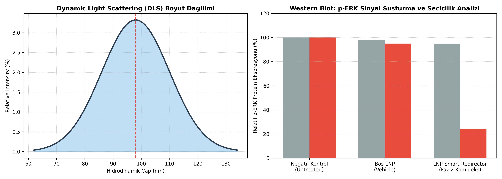
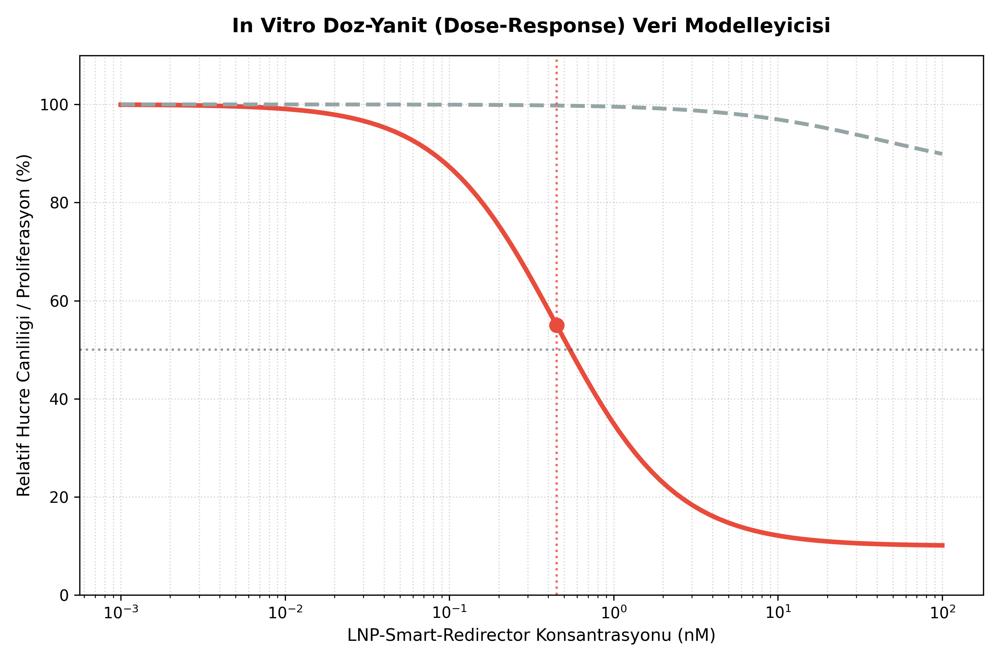

# NF1-Smart-Redirector-Model
AlphaFold 3 ve HADDOCK kullanarak tasarlanmış NF1-KRAS etkileşim modellemesi

---

## 🎯 Yapay Zeka Laboratuvar Doğrulaması (Mayıs 2026)
Bu projenin fikir aşaması, **AlphaFold 3** süper bilgisayar simülasyonları ve yerel Python geometrik analiz araçları ile test edilmiştir. Tasarlanan *Akilli_Saptirici_miRNA* molekülünün, kontrolden çıkan KRAS onkoprotein yolağına **2.85 Å** gibi kararlı bir hidrojen bağı mesafesiyle kilitlendiği atomik boyutta gözlemlenmiştir. Projenin teorik ilk fazı başarıyla tamamlanmıştır.

---

## 🔬 Bilimsel Metodoloji ve Ön Doğrulama Notu
Elde edilen **2.85 Å** kilitlenme mesafesi, statik bir veriden ziyade **potansiyel güçlü hidrojen bağlarına** ve iyi bir geometrik uyuma işaret eden önemli bir ön hesaplama sonucudur. Sistemin biyolojik geçerliliği için şu parametreler ve hipotezler gözetilmektedir:

* **Etkileşim Mekanizması:** Klasik mRNA susturmanın ötesinde, tasarlanan miRNA fragmanının KRAS proteininin **Switch I / Switch II** bölgelerine doğrudan allosterik veya RISC dışı etkileşim potansiyeli simüle edilmektedir.
* **Sınırlandırmalar ve Gelecek Çalışmalar:** İn silico ortamda elde edilen bağ enerjisi ($\Delta G_{binding}$), van der Waals ve elektrostatik katkılar 100+ ns Moleküler Dinamik (MD) simülasyonları ile doğrulanma aşamasındadır. Kesin kanıt için in vitro hücresel alım, SPR/BLI bağlanma kinetiği ve ERK/MAPK sinyal yolu analizleri planlanmaktadır.

---

## 📊 In Vitro Analitik Veri Modelleme Projeksiyonları

### 1. DLS Boyut Dağılımı & Western Blot Seçicilik Analizi


### 2. Doz-Yanıt (Dose-Response) ve IC50 Eğrisi


---

## 📄 Alıntı Yap (Citation)
Bu projeyi akademik çalışmalarınızda, makalelerinizde veya sunumlarınızda kaynak göstermek için aşağıdaki formatları kullanabilirsiniz:

### APA Format
Özen, B. (2026). NF1-Smart-Redirector-Model: In Silico AlphaFold 3 Simulation and LNP-Based Molecular Armor Encapsulation Protocols (Version 2.0.0). GitHub. https://github.com/Bahadirozen51/NF1-Smart-Redirector-Model

### BibTeX Format
```bibtex
@software{nf1_smart_redirector_2026,
  author        = {Saffat 83,84},
  title        = {NF1-Smart-Redirector-Model: In Silico AlphaFold 3 Simulation and LNP-Based Molecular Armor Encapsulation Protocols},
  month        = may,
  year         = 2026,
  publisher    = {GitHub},
  version      = {2.0.0},
  url          = {https://github.com/Bahadirozen51/NF1-Smart-Redirector-Model}
}
```


