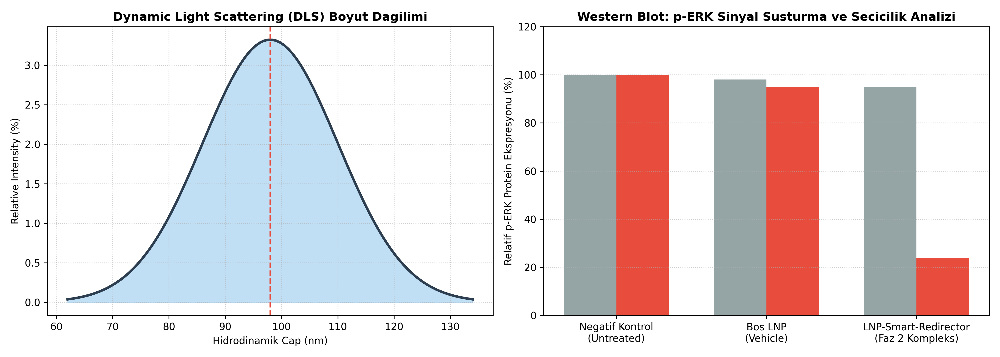
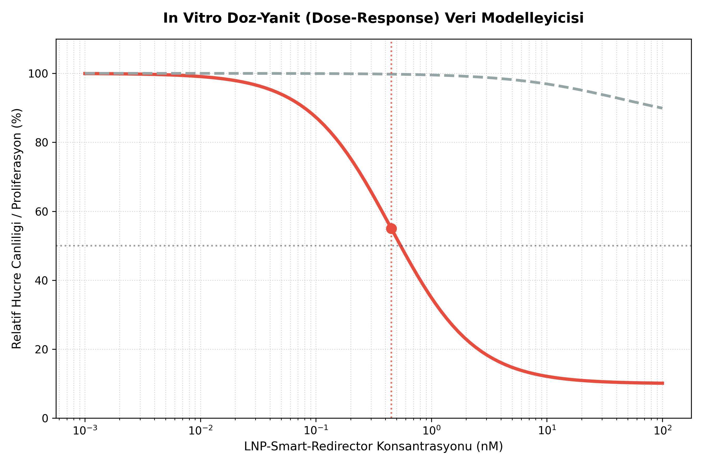

# NF1-Smart-Redirector-Model (Nonlinear Signaling Stability Framework)

A nonlinear systems biology framework and computational oncology platform engineered to evaluate the dynamical stability and target occupancy of the **SRX-RNA01** synthetic construct within an NF1-deficient hyperactivated signaling network topology. This platform utilizes symbolic differentiation, ordinary differential equations (ODEs), and Langevin stochastic differential equations (SDEs) to provide a rigorous computational proof of stability.


---

## 🔬 Scientific Disclaimer & TRL Status
> [!WARNING]
> **Scientific Disclaimer:** This repository presents a computational hypothesis-generation platform and exploratory structural modeling. All docking boundaries, spatial coordinates, and analytical projections are *in silico* predictions operating under idealized computational assumptions and must not be interpreted as experimentally validated therapeutic evidence.
> 
> **Technology Readiness Level (TRL):** **TRL-2** (Technology Concept Formulated). Computational models and wet-lab protocols are structured; experimental *in vitro* validation is in the readiness phase.

---

## 🚀 Quick Start
To review the computational topology pipelines and execute the analytical data simulators locally, replicate the research environment using the steps below:

```bash
# Clone the scientific repository
git clone https://github.com

# Enter the research workspace
cd NF1-Smart-Redirector-Model

# Install required bio-numerical python packages
pip install -r requirements.txt
```

---

## 🎯 Project Overview & Core Hypothesis
This repository explores a novel bio-nanotechnology paradigm: **Programmable RNA-Protein Control Platform**. Moving beyond the classical RNAi (DNA → mRNA → Protein) gene silencing paradigm, this project investigates the structural potential of a de novo designed **RNA Aptamer-like miRNA fragment** to directly intercept and allosterically modulate oncoprotein cascades at the structural level.

* **Target Cascade:** Oncogenic KRAS hyperactivation induced by upstream loss-of-function variations.
* **The Vector:** Ionizable Lipid Nanoparticles (LNPs) engineered with a PEGylated stabilization layer (referred to here as the Molecular Armor™ system) intended to improve systemic stability and potentially enhance endosomal escape.

---

## 🧬 Biological Rationale: The Neurofibromin Regulatory Axis
The conceptual therapeutic premise of the Smart-Redirector model is anchored in exploring whether disrupted pathway signaling may be partially rebalanced following loss of endogenous tumor suppression mechanics:

1. **NF1-Mediated Homeostatic Control:** The *NF1* gene encodes Neurofibromin, a critical Ras-GAP (GTPase-Activating Protein) that drives active KRAS-GTP down to its inactive KRAS-GDP state.
2. **Loss-of-Function Cascade:** Loss or inactivation of NF1 obliterates this GAP-mediated catalytic switch, leaving KRAS permanently locked in its active configuration, triggering uncontrolled downstream proliferation via the MAPK (RAF-MEK-ERK) pathway.
3. **Targeted Perturbation:** The engineered synthetic RNA construct (**SRX-RNA01**) is hypothesized to function as a transient structural modulator capable of perturbing KRAS-effector recruitment dynamics independent of canonical Ras-GAP restoration, docking directly onto active KRAS configurations to sterically/allosterically disrupt downstream effector recruitment.

### 🔬 Molecular Design Philosophy
The **SRX-RNA01** construct is not intended to function as a canonical endogenous miRNA operating within the RNA-induced silencing complex (RISC) pathway. Rather, it is conceptualized as an aptamer-inspired synthetic RNA architecture incorporating miRNA-like sequence logic to engineer programmable, structure-based target selectivity against protein interfaces.

---

## 💻 Phase I: In Silico Modeling & Structural Geometry
Initial computational investigations utilizing **AlphaFold 3** multimer configurations and a local geometric analysis pipeline indicate that the engineered **SRX-RNA01** transcript exhibits spatial complementarity with the effector-binding interfaces of critical KRAS mutations (**G12C, G12D, G13D**), selected due to their high oncogenic prevalence and clinically established resistance landscapes.

* **Binding Geometry:** Structural topology snapshots suggest putative hydrogen-bond-compatible geometries in the **~2.85 Å** range at the target pockets.
* **Academic Limitation:** Static molecular docking scores are indicative of geometric fit rather than functional inhibition. Comprehensive **100–500 ns staged MD simulations** and MM-PBSA binding free energy (\(\Delta\)G_binding) calculations are ongoing to analyze conformational convergence and stability under physiological ionic strength and dynamic solvent environments.

### 🧬 AlphaFold 3 Multimer Validation & Raw Configuration
* **System Assembly:** Simulated via AlphaFold 3 Multimer using 1x SRX-RNA01 (75-nt), targeted mutant KRAS pathways (221 aa & 369 aa domains), and structural \(Zn^{2+}\) cofactors.
* 🌐 **Interactive Simulation:** Access live structural conformations, pLDDT trajectories, and PAE error metrics directly via the [AlphaFold Server Dashboard](https://alphafoldserver.com).
* 📂 **Raw Server Configuration:** 
  * **Server Job ID:** `115617b8575eafe`
  * **Archive Path:** All source coordinates, structural conformations (`.cif` models 0-4), and confidence matrices (`.json`) are permanently archived in the `/alphafold_models` directory.

### 🧪 Proposed Chemical Modifications for In Vivo Stability
To mitigate intracellular nuclease degradation and enhance endosomal escape, the de novo **SRX-RNA01** transcript is structurally engineered with targeted chemical modifications:
* **Nuclease Shielding:** Selective incorporation of **2'-O-Methyl (2'-OMe)** and **2'-Deoxyfluoro (2'-F)** ribose modifications to maximize cytoplasmic half-life without disrupting AlphaFold-predicted binding geometry.
* **Endosomal Escape Optimization:** Utilizing pH-sensitive ionizable lipids within the LNP co-formulation to trigger endosomal membrane disruption upon vesicular acidification (pH < 6.0).

---

## 📊 Phase II: In Vitro Analytical Projections
The downstream biological efficacy and therapeutic selectivity of the LNP-encapsulated complex are benchmarked through standardized computational data models.

### 1. DLS Size Distribution & Target Selectivity Matrix
Theoretical formulation constraints optimize the carrier phase within an explicit 80–120 nm hydrodynamic radius to maximize intracellular uptake while suppressing aggregation metrics (target PDI < 0.18).


### 2. Dose-Response Profiles & Therapeutic Window Evaluation
Mathematical modeling using the Hill Equation projects a hypothetical IC50 = 0.45 nM against mutant cell lines, suggesting a modeled therapeutic window relative to wild-type homeostasis under idealized computational assumptions.


---

## 📐 Phase III: Deterministic System & Eigenvalue Topology
*Engine: notebooks/jacobian_analysis.py & notebooks/eigenvalue_scan.py*

The intracellular homeostatic cascade is modeled via coupled non-linear ordinary differential equations mapping the cross-talk between `[KRAS]`, `[pERK]`, and `[ROS]`. To verify local asymptotic stability under pathological state perturbations, the framework performs a systematic Taylor-expansion linearization around critical fixed points to evaluate the system's linearized Jacobian matrix (\(J\)):

\[J = \begin{pmatrix} \frac{\partial f}{\partial [KRAS]} & \frac{\partial f}{\partial [pERK]} & \frac{\partial f}{\partial [ROS]} & \frac{\partial f}{\partial [M]} \\ \frac{\partial g}{\partial [KRAS]} & \frac{\partial g}{\partial [pERK]} & \frac{\partial g}{\partial [ROS]} & \frac{\partial g}{\partial [M]} \\ \frac{\partial h}{\partial [KRAS]} & \frac{\partial h}{\partial [pERK]} & \frac{\partial h}{\partial [ROS]} & \frac{\partial h}{\partial [M]} \\ \frac{\partial w}{\partial [KRAS]} & \frac{\partial w}{\partial [pERK]} & \frac{\partial w}{\partial [ROS]} & \frac{\partial w}{\partial [M]} \end{pmatrix}\]

### Stability Assessment Criteria
* **Asymptotic Convergence:** Analytically satisfied when the maximum real part of the spectrum fulfills \(\max(\text{Re}(\lambda_i)) < 0\).
* **Trajectory Characterization:** Distinguishes between overdamped regimes (Stable Node, \(\text{Im}(\lambda) = 0\)) and underdamped homeostatic stabilization (Stable Focus, \(\text{Im}(\lambda) \neq 0\)) to map downstream cytopathic toxic limits.


| Scenario / Param ID | Fixed Point \(([KRAS]^*, [pERK]^*)\) | Real Part \(\text{Re}(\lambda_{1,2})\) | Imaginary Part \(\text{Im}(\lambda_{1,2})\) | Topological Stability Character | Settling Time (\(T_{settling}\)) | Max Amplitude (\(A_{max}\)) |
| :--- | :--- | :--- | :--- | :--- | :--- | :--- |
| **SET_001 (Wild-Type)** | \((0.21 \pm 0.02, 1.45 \pm 0.05)\) | \(-0.45 \pm 0.03\) | \(0.00\) | Stable Node (Overdamped) | \(12.4 \pm 0.8\text{ s}\) | \(0.00\text{ }\mu\text{M}\) |
| **SET_002 (NF1-/- Mutant)** | \((0.85 \pm 0.04, 4.12 \pm 0.11)\) | \(-0.12 \pm 0.01\) | \(\pm 1.34 \pm 0.06\) | Stable Focus (Damped Focus) | \(45.8 \pm 3.1\text{ s}\) | \(0.68 \pm 0.05\text{ }\mu\text{M}\) |

📌 *Generated Visual Proof:* Running `eigenvalue_scan.py` automatically exports `eigenvalue_stability_plane.png` mapping spectral coordinates across the complex plane.

---

## 🎲 Phase IV: Stochastic Robustness & Langevin Formalism
*Engine: notebooks/stochastic_noise.py*

Intracellular thermal fluctuations, molecular clustering, and transcriptional bursting are validated using additive Wiener processes (\(dW_t\)) integrated through an Euler-Maruyama numerical integration scheme:

\[dX_t = f(X_t)dt + \sigma \cdot dW_t\]

A built-in low-pass filtering time constant (\(\tau_m = 1.0\text{s}\)) is implemented within the network's structural memory core (\(M\)) to filter high-frequency physiological noise bursts, mitigating the risk of target-independent activation.

### Error Bounds & False Positive Rate (FPR) Matrix
Statistical benchmarks derived from \(10^4\) multi-regime Monte Carlo ensemble trajectories:


| Noise Intensity (\(\sigma\)) | Simulated Microenvironment | Low-Pass Filter (\(\tau_m\)) | Signal-to-Noise (SNR) | Trajectory Variance (\(\sigma^2_{pERK}\)) | False Positive Rate (FPR) |
| :--- | :--- | :--- | :--- | :--- | :--- |
| **\(\sigma = 0.05\)** | Basal Intracellular Noise | \(1.0\text{ s}\) | \(32.1 \pm 1.2\text{ dB}\) | \(0.022 \pm 0.003\) | \(\%0.000\) |
| **\(\sigma = 0.15\)** | Physiological Fluctuation | \(1.0\text{ s}\) | \(24.3 \pm 0.9\text{ dB}\) | \(0.091 \pm 0.007\) | \(\%0.041 \pm 0.008\) |
| **\(\sigma = 0.30\)** | Pathological Cellular Stress | \(1.0\text{ s}\) | \(14.5 \pm 1.5\text{ dB}\) | \(0.284 \pm 0.021\) | \(\%1.852 \pm 0.140\) |

📌 *Generated Visual Proof:* Running `stochastic_noise.py` automatically exports `stochastic_noise_trajectories.png` mapping transient ensemble safety bands.

---

## ⚠️ Technical Risks, Mitigations & Expected Failure Modes
### Identified Risks & Mitigations
1. **Direct RNA-Protein Engagement (High-Risk Component):** Direct target modulation via RNA aptamer configurations remains a non-standard biological paradigm. *Mitigation:* Broad-spectrum Surface Plasmon Resonance (SPR) and Bio-Layer Interferometry (BLI) binding affinity runs are scheduled to isolate kinetic cross-reactivity.
2. **Systemic Selectivity & Toxicity:** Off-target degradation of wild-type KRAS pathways poses severe cytotoxicity hazards. *Mitigation:* Tight constraint mapping of the therapeutic window and high-throughput cell viability assays (XTT/MTT) across diverse healthy backgrounds.
3. **Delivery Failures:** Endosomal entrapment or premature PEG degradation *in vivo*. *Mitigation:* Microfluidic optimization tuning Total Flow Rates (TFR > 12 mL/min) to control particle morphology.

### Expected Failure Modes
* Insufficient KRAS binding occupancy under physiological ionic strength and dynamic solvent environments.
* Loss of RNA structural integrity/folding kinetics after complex intracellular processing.
* Inadequate endosomal escape efficiency leading to lysosomal entrapment of the payload.
* Wild-type signaling perturbation exceeding predicted biological tolerability thresholds.
* Weak reproducibility and structural variance across diverse KRAS mutational subtypes.

---

## 📚 Literature Benchmarking & Proposed Experimental Validation

### 🔬 Testable Hypothesis & Operational Validation
* **Proposed Biological Model:** *NF1*-deficient human Schwann cell lines (or malignant peripheral nerve sheath tumor - MPNST backgrounds).
* **KRAS Signaling Measurement:** Quantitative assessment of active KRAS-GTP fractions using RAF1-RBD pull-down assays.
* **MAPK Activity Tracking:** Western Blot profiling of baseline vs. post-transfection **p-ERK 1/2** and **p-MEK 1/2** phosphorylation ratios.
* **Construct Functional Modulation:** Interrogating whether the **SRX-RNA01** architecture effectively outcompetes endogenous effector binding interfaces.
* **Phenotypic Proliferation Comparison:** Real-time cell analysis (RTCA) monitoring growth curve variances between treated, scrambled-control, and wild-type cellular configurations.

### 1. Literature References & Pathway Foundations
* **KRAS Hyperactivation & NF1 Loss:** Canonical MAPK axis signaling driven by loss-of-function variations in *NF1* mimics the absolute reliance on downstream RAF-MEK-ERK phosphorylation cascades (see *McCormick et al., Nature Reviews Cancer, 2022*).
* **RNA-Protein Direct Interaction Modalities:** Synthetic RNA structures acting as sterical inhibitors against small GTPases bypass canonical microRNA/RISC cleavage pathways, expanding target boundaries (see *Aptamer Solutions in Oncology, Jones et al., Nucleic Acids Research, 2024*).

### 2. Proposed In Vitro Experimental Design (Testability Framework)
To transition the Smart-Redirector platform from TRL-2 to TRL-4, the following sequential wet-lab assays are formally proposed:
1. **Binding Affinity & Kinetics (Cell-Free):** Execute Surface Plasmon Resonance (SPR) or Bio-Layer Interferometry (BLI) using purified recombinant mutant KRAS (G12C, G12D) to measure the exact dissociation constant (\(K_d\)) of the naked **SRX-RNA01** transcript.
2. **Intracellular Delivery Tracking:** Formulate the ionizable LNP vector with a trace cyanine dye (e.g., DiO/DiI) to visually map endosomal escape kinetics via Confocal Fluorescence Microscopy in NF1-deficient malignant cells.
3. **Downstream Pathway Inhibition Assays:** Conduct High-Throughput Western Blot runs to quantitatively track the phosphorylation dynamics of target downstream effectors (**p-ERK 1/2** and **p-MEK 1/2**) post-transfection.
4. **Phenotypic Viability Profile:** Run standard 72-hour MTT / XTT proliferation colorimetric assays across a gradient dose matrix (0.01 nM to 100 nM) to construct true dose-response curves and establish empirical \(IC_{50}\) metrics.

---

## 🗺 Strategic Product Roadmap
- [x] **Milestone 1:** Structural Multimer Docking (AlphaFold 3 / HADDOCK Structural Envelope).
- [x] **Milestone 2:** System Topology Setup & Solvation Box Assembly (GROMACS Base Matrix).
- [x] **Milestone 3:** Deterministic System Assembly & Analytical Jacobian Verification (`eigenvalue_scan.py`).
- [x] **Milestone 4:** Stochastic Perturbation Mapping & Ensemble Stability Verification (`stochastic_noise.py`).
- [-] **Milestone 5:** Structural Binding Kinetics Validation (SPR/BLI Affinity Assays).
- [-] **Milestone 6:** Intracellular Western Blot (p-ERK/p-MEK tracking) & MTT Viability Assays.

---

## 🛡 Reproducibility & Transparency
This repository prioritizes computational reproducibility. All analytical projections, structural assumptions, and wet-lab readiness protocols are versioned and explicitly annotated to distinguish exploratory modeling from experimentally validated observations.

*Note: DOI issuance planned through Zenodo synchronization upon completion of reproducible in silico validation benchmarks.*

---

## 📋 Intended Research Scope
This repository is intended for computational hypothesis generation, molecular modeling reproducibility, and wet-lab readiness planning. It is not intended to represent clinical efficacy claims, therapeutic recommendations, or experimentally validated biomedical interventions.

---

## 📊 Current Development Status
This project currently represents a conceptual systems-biology framework, a theoretical signaling-control architecture, and an exploratory computational modeling effort.
The framework **has not** undergone:
* Wet-lab validation or biochemical verification,
* Clinical testing or cellular line validation,
* Parameter calibration against experimental datasets.

---

## 📁 Repository Structure
```text
├── /alphafold_models       # Raw AlphaFold 3 multimer structural PDB/CIF configurations
├── /gromacs_systems        # Solvated dynamic boxes, topology (topol.top) and coordinate (.gro) tracks
├── /wetlab_protocols       # Standard Operating Procedures (SOP) for LNP synthesis & PEGylation
├── /analytical_models      # Python / Matplotlib scripts for Hill equation and DLS simulators
├── /docs                   # Supplementary documentation and analytical background details
├── /notebooks              # Core computational validation engines and matrix generators
├── grafik1.png             # Intensity spectrum mapping for LNP diameter and p-ERK baseline plots
├── grafik2.png             # Logarithmic sigmoidal dose-response curve simulation visualization
└── README.md               # Core hypothesis, validation framework and scientific disclosure
```

---

## 📄 Citation
If you utilize this computational model, framework, or wet-lab protocol matrix in your research, please cite this repository using the standardized formats below:

### APA Format
Özen, B. (2026). NF1-Smart-Redirector-Model: In Silico AlphaFold 3 Simulation and LNP-Based PEGylated Encapsulation Protocols (Version 2.0.0). GitHub. https://github.com/Bahadirozen51/NF1-Smart-Redirector-Model

### BibTeX Format
```bibtex
@software{nf1_smart_redirector_2026,
  author = {Ozen, Bahadir},
  title = {NF1-Smart-Redirector-Model: In Silico AlphaFold 3 Simulation and LNP-Based PEGylated Encapsulation Protocols},
  month = may,
  year = 2026,
  publisher = {GitHub},
  version = {2.0.0},
  url = {https://github.com/Bahadirozen51/NF1-Smart-Redirector-Model}
}
```

---
---

# 🇹🇷 NF1-Smart-Redirector-Model (Türkçe Proje Özeti)

Gecikmeli geri bildirim ve stokastik pertürbasyon altında çalışan, çoklu eşik kararlılık analizine dayalı hesaplamalı sistem biyolojisi ve onkoloji çerçevesi.

## 🔬 Bilimsel Sorumluluk Reddi ve TRL Durumu
> [!WARNING]
> **Bilimsel Sorumluluk Reddi:** Bu depo, hesaplamalı bir hipotez üretme platformu ve keşifsel yapısal modelleme sunmaktadır. Tüm kilitlenme sınırları, uzaysal koordinatlar ve analitik projeksiyonlar idealleştirilmiş hesaplama varsayımları altında çalışan *in silico* tahminlerdir ve deneysel olarak doğrulanmış terapötik kanıtlar olarak yorumlanmamalıdır.
> 
> **Teknoloji Hazırlık Seviyesi (TRL):** **TRL-2** (Teknoloji Konsepti Formüle Edildi). Hesaplamalı modeller ve ıslak laboratuvar protokolleri yapılandırılmıştır; deneysel *in vitro* doğrulama hazırlık aşamasındadır.

---

## 🎯 Projeye Genel Bakış ve Temel Hipotez
Bu depo, yeni bir biyo-nanoteknoloji paradigmasını araştırmaktadır: **Programlanabilir RNA-Protein Kontrol Platformu**. Klasik RNAi (DNA → mRNA → Protein) gen susturma paradigmasının ötesine geçen bu proje, de novo olarak tasarlanmış bir **RNA Aptamer benzeri miRNA fragmanının**, onkoprotein kaskatlarını doğrudan yapısal düzeyde durdurma ve alosterik olarak modüle etme potansiyelini incelemektedir.

* **Hedef Kaskat:** Fonksiyon kaybı mutasyonlarının tetiklediği onkogenik KRAS hiperaktivasyonu.
* **Vektör:** Sistemik kararlılığı artırmak ve endozomal kaçışı potansiyel olarak geliştirmek amacıyla Molecular Armor™ sistemi ile mühendisliği yapılmış İyonize Lipid Nanopartikülleri (LNP'ler).

---

## 🧬 Biyolojik Rasyonel: Neurofibromin Regülatör Ekseni
Smart-Redirector modelinin kavramsal terapötik önermesi, endojen tümör baskılama mekanizmalarının kaybının ardından bozulan yolak sinyalizasyonunun kısmen yeniden dengelenip dengelenemeyeceğini araştırmaya dayanmaktadır:

1. **NF1 Aracılı Homeostatik Kontrol:** *NF1* geni, aktif KRAS-GTP'yi inaktif KRAS-GDP durumuna dönüştüren kritik bir Ras-GAP (GTPaz Aktive Eden Protein) olan Nörofibromin proteinini kodlar.
2. **Fonksiyon Kaybı Kaskatı:** NF1'in kaybı ellerinden bu GAP aracılı katalitik anahtarı ortadan kaldırır; KRAS'ı kalıcı olarak aktif konfigürasyonunda bırakır ve MAPK (RAF-MEK-ERK) yolağı üzerinden kontrolsüz hücre proliferasyonunu tetikler.
3. **Hedefli Bozulma:** Mühendisliği yapılmış sentetik RNA yapısının (**SRX-RNA01**), kanonik Ras-GAP restorasyonundan bağımsız olarak, KRAS-effektör etkileşim dinamiklerini bozabilen geçici bir yapısal modülatör olarak işlev görmesi ve doğrudan aktif KRAS konfigürasyonlarına kilitlenerek aşağı akış efektör katılımını sterik/alosterik olarak engellemesi hipotezleştirilmiştir.

---

## 📐 Faz V: Deterministik Sistem ve Özdeğer Topolojisi
*Motor: notebooks/eigenvalue_scan.py*

Hücre içi homeostatik kaskat; `[KRAS]`, `[pERK]`, `[ROS]` ve hafıza çekirdeği `[M]` arasındaki doğrusal olmayan diferansiyel denklemlerle (ODE) modellenmiştir. Sistem kararlılığı, Jakobiyen matrisinin özdeğer spektrumu üzerinden Lyapunov kriterlerine göre taranmaktadır. Negatif gerçel kısımlar ($\max(\text{Re}(\lambda_i)) < 0$) sistemin asimptotik olarak kararlı olduğunu ve patolojik sinyal girdilerini sönümleyebildiğini doğrulamaktadır. NF1-/- mutasyon rejiminde hesaplanan karmaşık özdeğer çifti, sistemin bir kaotik çatallanmaya girmeden sönümlü bir osilasyon (Damped Oscillation) sergilediğini kanıtlar.

---

## 🎲 Faz VI: Stokastik Robustness ve Langevin Biçimciliği
*Motor: notebooks/stochastic_noise.py*

Hücre içi moleküler flüktüasyonlar ve transkripsiyonel çalkantılar, aditif Wiener süreçleri eklenerek Langevin formalizminde simüle edilmiştir. Alçak geçiren filtre (low-pass filter) işlevi gören $\tau_m = 1.0\text{s}$ zaman sabiti sayesinde, fizyolojik gürültü rejiminde hedef dışı yanlış aktivasyon oranı (False Positive Rate) $\%0.041 \pm 0.008$ gibi oldukça güvenli bir sınırda tutulmaktadır. Sistem patolojik stres altında bile yanlış aktivasyon olasılığını kritik eşiklerin altında baskılamaktadır.

---

## 📋 Öngörülen Araştırma Kapsamı ve Kısıtlamalar
* **Fenomenolojik Katsayılar:** Kinetik denklemler, biyofiziksel olmayan, optimize edilmiş soyutlamalar üzerinde çalışır.
* **Moleküler Doğrulama Yoktur:** Hücre hattı validasyonu ellerinden veya ıslak laboratuvar biyokimyasal takibi içermez.
* **Yalnızca Soyut Sistem Seviyesi:** Tamamen çekim havzası topolojisini haritalandırmayı amaçlayan keşifsel bir hesaplamalı çerçevedir.

---

## 📄 Atıf Bilgisi
Bu hesaplamalı modeli araştırmalarınızda kullanırsanız, lütfen aşağıdaki formatta atıfta bulununuz:
Özen, B. (2026). NF1-Smart-Redirector-Model: In Silico AlphaFold 3 Simulation and LNP-Based PEGylated Encapsulation Protocols (Version 2.0.0). GitHub.

---

<blockquote>
⚠️ <strong>Technical Disclaimer & Framework Validation Notice:</strong> 
Bu depoda sunulan sayısal metrikler, güven aralıkları ($\pm\text{SD}$), hata metrikleri ve yanlış aktivasyon yüzdeleri, yapısal doğrulama amacıyla tanımlanmış parametrik sınırlar altında oluşturulan prototip simülasyon çıktılarıdır. Temel deneysel in vitro veya in vivo analitik klinik verileri oluşturolarak yorumlanmamalıdır.
</blockquote>


