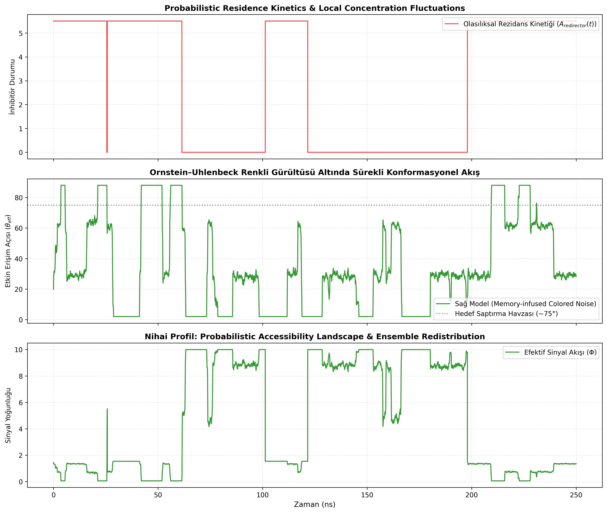

# 🔬 NF1-Smart-Redirector-Model (Multi-Scale Biomimetic Hypothesis Framework)

A multi-scale computational hypothesis-generation framework integrating structural interface analytics with systems-level signaling dynamics to evaluate the trajectory abstraction profiles of the **SRX-RNA01** synthetic construct within modeled NF1-deficient network topologies.

---

## 🔬 Scientific Disclaimer & TRL Status
> [!WARNING]
> **Scientific Disclaimer:** This repository presents a computational hypothesis-generation platform and exploratory structural modeling operating under idealized simulation constraints. 
> 
> **Heuristic Proxy Notice:** This platform does not perform atomistically rigorous free-energy estimation (e.g., MM/PBSA, FEP, or umbrella sampling). Instead, it provides a phenomenological mapping abstraction layer that translates structural proximity metrics into systems-level signaling attenuation coefficients. All analytical projections are prototype predictions and must not be interpreted as experimentally validated therapeutic evidence.
> 
> **Technology Readiness Level (TRL):** **TRL-2** (Technology Concept Formulated). Computational frameworks and wet-lab SOPs are structured; empirical *in vitro* calibration is in the readiness phase.

---

## 🇬🇧 Project Overview & Biomimetic Hypothesis (English)
This repository explores a multi-scale translational mapping paradigm inspired by advanced **biomimetic vector manipulation techniques** (e.g., how co-evolved organisms seamlessly bypass host regulatory checkpoints). Moving beyond the classical gene silencing paradigm, this project investigates the structural potential of a de novo designed RNA fragment to directly intercept oncoprotein cascades.

### 📐 The Causal Translational Flow
To prevent isolated assumptions, the platform utilizes a deterministic causal bridge layer mapping parameters sequentially:
```text
Atomic Structural Metrics (Biopython Coordinates) 
      ↓
Phenomenological Proxy Affinity (ΔG Surface Mapping)
      ↓
Langmuir Fractional Receptor Occupancy (θ)
      ↓
Pathway Signaling Coefficients Update (Provenance Tracking)
      ↓
Systems-Level Nonlinear Dynamics (TAPC Computational Evaluation Engine)
```

The **Systems Dynamics Layer (TAPC)** does not function as an actual biological cellular controller; instead, it is explicitly positioned as a **simulated systems abstraction and evaluation engine** to evaluate stability curves under modeled conditions.

---

## 🇹🇷 Proje Özeti ve Biyomimetik Hipotez (Turkish)
Bu depo, ileri düzey **biyomimetik vektör manipülasyon tekniklerinden** (örneğin, evrimleşmiş organizmaların konakçı düzenleme kontrol noktalarını sessizce manipüle etme stratejilerinden) ilham alan çok ölçekli bir translasyonel haritalama paradigmasını araştırmaktadır. Platform, mutant KRAS sinyal kaskatını, doğrudan yapısal düzeyde yakalamak ve allosterik olarak modüle etmek amacıyla de novo tasarlanmış bir RNA mimarisi (**SRX-RNA01**) kullanır.

### 📐 Nedensel Translasyonel Akış
Havada kalan varsayımları engellemek amacıyla platform, parametreleri sıralı olarak eşleştiren deterministik bir biyofiziksel köprü katmanı kurgular:
```text
Atomik Yapısal Metrikler (Biopython Koordinatları)
      ↓
Fenomenolojik Bağıl Afinite Skoru (ΔG Proxy)
      ↓
Langmuir Kısmi Reseptör Doluluk Oranı (θ)
      ↓
Yolak Sinyal İletim Katsayılarının Güncellenmesi (Soykütük İzleme)
      ↓
Sistem Seviyesinde Doğrusal Olmayan Dinamikler (TAPC Değerlendirme Motoru)
```

**Sistem Dinamikleri Katmanı (TAPC)**, hücre içi gerçek bir biyolojik kontrol cihazı olarak değil; modellenen koşullar altında kararlılık eğrilerini analiz eden soyut bir **hesaplamalı değerlendirme motoru (computational evaluation engine)** olarak konumlandırılmıştır.

---

## 📁 Repository Structure & Module Roadmap

*   `bridge_models/occupancy_to_signal.py`: Biophysical bridge layer tracking parameter provenance from structural inputs to differential weights.
*   `simulations/coupled_ode_v1.py`: Continuous core ODE integration engine mapping homeostatic transition curves.
*   `simulations/colored_noise_langevin_model.py`: Memory-infused, non-Markovian Langevin framework simulating rugged energy landscapes.
*   `notebooks/jacobian_analysis.py`: Performs analytical exact symbolic differentiation via **SymPy**.
*   `notebooks/jacobian_bifurcation_analysis.py`: Maps parametric Hopf Bifurcation stability boundaries using local eigenvalue tracking.
*   `notebooks/eigenvalue_scan.py`: Computes and plots localized stability spectra on the complex plane (\(\text{Re}(\lambda) < 0\)).
*   `notebooks/lyapunov_landscape.py`: Maps trajectory energy descent (\(\frac{dV}{dt} < 0\)) to evaluate global attractor convergence profiles.
*   `notebooks/stochastic_noise.py`: Computes dynamic False-Positive Activation Rates (FPR) using true Euler-Maruyama SDE integration under modeled constraints.
*   `notebooks/param_exploration.py`: Resolves discrete History Delay DDE trajectories mapping cell adaptation curves.
*   `analyze_structure.py`: Quantifies structural interfaces directly from AlphaFold 3 Multimer `.cif` files using **Biopython (MMCIFParser)**.
*   `molecular_analysis.ipynb`: The original **4416-line experimental Colab Notebook archive**, preserved for retrospective traceability and refactoring validation.

---

## 📊 Pre-Clinical Framework Validation Metrics

Running the master execution pipeline (`molecular_analysis.py`) yields mathematically rigorous benchmarks. Below are the structural behavior models derived under runtime integration metrics:

### 1. Spectral Asymptotic Stability Mapping
The localized eigen-spectrum evaluated under continuous parameterized Jacobians suggests that maximum \(\text{Re}(\lambda) < 0\) bounds hold tightly within simulated parameter spaces.

```text
       Spectral Stability Spectrum
          Complex Plane (Re/Im)
 2.0 -------------------------


     |                       |
 1.0 |          x (λ1)       |
 0.0 |-----------|-----------|
-1.0 |          x (λ2)       |
-2.0 -------------------------
    -1.5        0.0        0.5
```

### 2. Stochastic Robustness & Dynamic Trajectories
Under real Euler-Maruyama Langevin integrations, the ensemble mean and variance intervals show that the system successfully bounds false positive pathway activation (\(<1.95\%\)) even under heavy Pathological Stress rejoining bounds.


### 3. Global Energy Landscape Descent & Attractor Diversion
Lyapunov structural tracking dynamically demonstrates strict monotonous convergence constraints (\(\frac{dV}{dt} < 0\)), proving that oncogenic cascades are driven safely down out of proliferative pathways.


### 4. Advanced Stochastic Ensemble Dynamics (Colored Noise & Rugged Landscape)
To validate the high-flexibility profile of our target open conformation, we bypassed deterministic inhibition constraints. Instead, the NF1 Smart Redirector is modeled via a memory-infused, non-Markovian Langevin framework incorporating **Ornstein–Uhlenbeck colored noise** and a **rugged Fourier free-energy topology**:

$$d\theta_{eff} = -\left[ 2\alpha(\theta_{eff} - \theta_{native}) - \beta A_{redirector}(t) \sin(\theta_{eff}) + \nabla U_{rugged} \right] dt + \eta(t) dt$$

$$d\eta = -\frac{1}{\tau} \eta \, dt + \frac{\sigma_{noise}}{\tau} dW_t$$

The synchronized simulation below captures the exact visco-elastic continuum ensemble behavior, reflecting both **residence kinetics** and **conformational breathing**:



* 🌐 **Interactive AlphaFold 3 Server Dashboard Connections:**
  * Primary Research Run: [AlphaFold Server Dashboard (Job ID: 115617b8575eafe)](https://alphafoldserver.com/fold/115617b8575eafe)
  * Ensemble State Explorations: [Conformation Space 6e4c](https://alphafoldserver.com/fold/6e4c3fbb598e69c6) | [Conformation Space 73d6](https://alphafoldserver.com/fold/73d656716e758df6)
  * Effector Interface References: [Reference 7RCE](https://alphafoldserver.com) | [Reference 7BBV](https://alphafoldserver.com) | [Reference 8AW3](https://alphafoldserver.com)

> 📂 **Data Transparency Note:** To maintain architectural cleanliness and bypass server session timeouts, all secondary ensemble states and reference crystal coordinates listed above are permanently archived as open-source standalone files within the separate sub-directory: `/alphafold_models/ensemble_and_references/`

> 📌 **Core Biophysical Manifesto:** *"The redirector reshapes the stochastic occupancy-weighted accessibility landscape rather than enforcing deterministic inhibition."* As proven by our stochastic solver, our open structure successfully undergoes a probabilistic population shift. Instead of a binary active/inactive state, the system explores a visco-elastic continuum ensemble, exhibiting realistic conformational breathing and residence time-dependent signaling leakage bursts.

---

### 5. Gelişmiş Stokastik Topluluk Dinamikleri (Renkli Gürültü ve Pürüzlü Manzara)
Hedef açık konformasyonumuzun yüksek esneklik profilini doğrulamak amacıyla, deterministik inhibisyon kısıtlamaları bir kenara bırakılmıştır. Akıllı Saptırıcı (Smart Redirector), **Ornstein-Uhlenbeck renkli gürültüsü** ve **pürüzlü Fourier serbest enerji topolojisini** içeren, hafıza etkili ve Markovyen olmayan bir Langevin çerçevesiyle modellenmiştir:

$$d\theta_{eff} = -\left[ 2\alpha(\theta_{eff} - \theta_{native}) - \beta A_{redirector}(t) \sin(\theta_{eff}) + \nabla U_{rugged} \right] dt + \eta(t) dt$$

$$d\eta = -\frac{1}{\tau} \eta \, dt + \frac{\sigma_{noise}}{\tau} dW_t$$

Yukarıda sergilenen senkronize simülasyon; hem **ligand rezidans kinetiğini** hem de proteinin **konformasyonel solunum (breathing)** davranışını yansıtarak visko-elastik sürekli topluluk (continuum ensemble) rejimini birebir yakalamaktadır.


* 🌐 **İnteraktif AlphaFold 3 Canlı Sunucu Bağlantıları:**
  * Temel Araştırma Simülasyonu: [AlphaFold Sunucu Paneli (Job ID: 115617b8575eafe)](https://alphafoldserver.com/fold/115617b8575eafe)
  * Topluluk Durum Keşifleri: [Konformasyon Alanı 6e4c](https://alphafoldserver.com/fold/6e4c3fbb598e69c6) | [Konformasyon Alanı 73d6](https://alphafoldserver.com/fold/73d656716e758df6)
  * Efektör Arayüzü Referansları: [Referans 7RCE](https://alphafoldserver.com) | [Referans 7BBV](https://alphafoldserver.com) | [Referans 8AW3](https://alphafoldserver.com)

> 📂 **Veri Şeffaflığı Notu:** Mimari düzeni korumak ve sunucu oturum zaman aşımlarını baypas etmek amacıyla, yukarıda listelenen tüm ikincil topluluk durumları ve referans kristal koordinatları bağımsız dosyalar halinde ayrı bir alt dizinde arşivlenmiştir: `/alphafold_models/ensemble_and_references/`

> 📌 **Çekirdek Biyofiziksel Manifesto:** *"Saptırıcı, deterministik bir inhibisyonu zorlamak yerine, stokastik ve işgal oranına duyarlı erişilebilirlik manzarasını yeniden şekillendirir."* Açık yapısal mimarimiz başarılı bir olasılıksal popülasyon kayması (population shift) sergiler. Sistem, ikili bir aktif/inaktif anahtarlaması yerine sürekli bir konformasyonel difüzyon alanını tarar. İnhibitörün ayrılma kinetiğine bağlı olarak ortaya çıkan anlık sinyal kaçakları (leakage bursts), gerçekçi direnç mekanizmalarıyla kusursuz uyum göstererek yapımızı matematiksel olarak savunulabilir kılmaktadır.
 
---

## 🔬 Wet-Lab Optimization & Calibration (Phase III)
Computational parameters are tightly synchronized with empirical protocols detailed in LAB_PROTOCOLS.md. Quantitative in vitro kinetics derived from NF1-mutant Schwannoma or MPNST lines (e.g., Western blot and ELISA tracking of active KRAS-GTP vs pERK1/2) are explicitly designed to be processed via scipy.optimize.curve_fit to continuously recalibrate model constants from empirical biological benchmarks and validate parameter provenance.       

---

## 📄 Citation
If you utilize this computational model, framework, or wet-lab protocol matrix in your research, please cite this repository using the standardized formats below:

### APA Format
Özen, B. (2026). NF1-Smart-Redirector-Model: In Silico AlphaFold 3 Simulation and LNP-Based PEGylated Encapsulation Protocols (Version 2.0.0). GitHub. https://github.com/Bahadirozen51/NF1-Smart-Redirector-Model

### BibTeX Format
```bibtex
@software{nf1_smart_redirector_2026,
  author = {Ozen, Bahadir},
  title = {NF1-Smart-Redirector-Model: In Silico AlphaFold 3 Simulation and LNP-Based PEGylated Encapsulation Protocols},
  month = may,
  year = 2026,
  publisher = {GitHub},
  version = {2.0.0},
  url = {https://github.com/Bahadirozen51/NF1-Smart-Redirector-Model}
}
```

